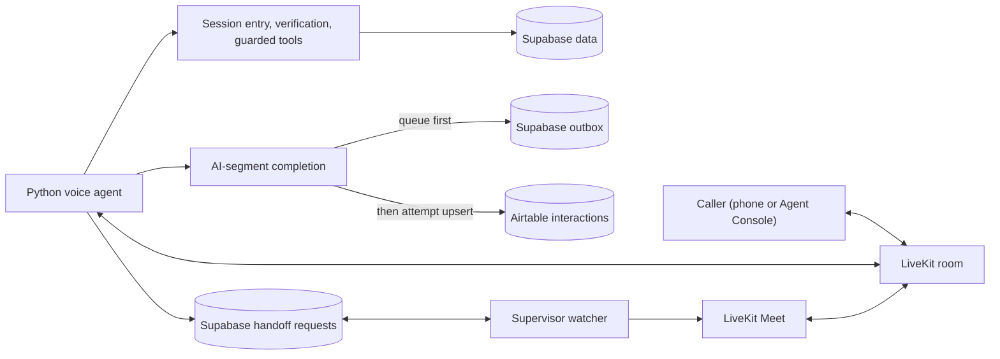

# Claims Support Assistant

I built this VoiceAI agent for the Observe.AI AI Agent Engineer take-home. It handles inbound calls for fictional Observe Insurance: a caller can ask general claims questions, check an existing synthetic claim after verification, or ask to speak with a person. At the end of the AI portion of the call, it records a sanitized interaction.

My goal was a working, explainable system rather than a collection of impressive-looking components. One LiveKit agent handles the conversation; deterministic Python code owns verification, claim access, handoff state, and post-call delivery. The project uses synthetic data only and is not a production insurance service.

## What the caller can do

- Invited callers must receive the demo participation notice before joining or dialing. The short spoken greeting identifies the assistant as automated and invites the caller's request without a separate verbal consent turn.
- Ask public questions about hours, mailing address, starting a claim, the general process, documents, and emergencies. Answers come from a versioned twelve-topic FAQ, not unrestricted model knowledge. Its general-enquiries email is explicitly fictional and non-deliverable, never a destination for claim documents.
- Check an existing claim. The account phone is a lookup key, not proof of identity. The agent confirms it, then confirms a claim ID and ZIP/postal code together before server code allows claim-specific information. At most three completed verification bundles are accepted per call.
- Request a representative without explaining why or completing verification. A supervisor can join the same LiveKit room; the agent calls the handoff successful only after the expected participant actually joins.

The assistant does not file or adjudicate claims, interpret coverage, take payments, promise callbacks, or accept real personal information. Failed lookup and mismatched factors have the same caller-facing verification response.

## How I built it

| Responsibility | Implementation |
| --- | --- |
| Voice and room transport | LiveKit Agents with Deepgram Nova-3 STT, GPT-4.1 mini, and Cartesia Sonic-3 TTS through LiveKit Inference |
| Conversation | One agent with a versioned prompt; tool calls pass through a testable workflow layer |
| Authorization | Per-call server state, confirmed factors, attempt limits, and guarded claim reads; the LLM cannot mark a caller verified |
| Customer, claims, and FAQ data | Synthetic Supabase/Postgres tables accessed only by server-side adapters |
| Post-call record | A sanitized interaction is queued in a Supabase outbox before an immediate idempotent Airtable upsert |
| Human handoff | A terminal watcher shows a minimal summary and a short-lived, room-scoped LiveKit Meet link; no custom WebRTC frontend |



The code follows those boundaries directly: [agent.py](src/agent.py) wires the voice session using the active [prompt](src/prompts/v3.py), [voice_workflow.py](src/voice_workflow.py) connects tools to policy, [session_state.py](src/session_state.py) and [verification.py](src/verification.py) guard access, and [supabase_claims.py](src/supabase_claims.py) returns only approved claim fields. [postcall.py](src/postcall.py), [outbox.py](src/outbox.py), and [airtable_writer.py](src/airtable_writer.py) handle completion. The active FAQ source is [faq_v3.json](knowledge/faq_v3.json); schema and setup details are in [migrations](migrations/) and [integration_setup.md](docs/integration_setup.md).

I chose a small, pinned FAQ over a RAG system because these answers are finite and policy-sensitive. I keep unknown accounts and mismatched factors on the same caller-facing path to avoid revealing whether an account exists. I use LiveKit Meet for the supervisor's same-room join instead of maintaining a custom browser app.

I used an outbox because an Airtable timeout can leave delivery uncertain; the `Call ID` provides a logical idempotency key. The current implementation makes one immediate Airtable attempt and records failure state, but it does **not** run an automatic retry worker.

## Run it locally

You need Python 3.10–3.14, `uv`, a LiveKit Cloud project, and the synthetic Supabase and Airtable services described in [integration_setup.md](docs/integration_setup.md). Create `.env.local` from [.env.example](.env.example) only if it does not already exist, then fill in your own server-side credentials. Never commit that file. The private synthetic verification factors are intentionally not in this repository; I provide them separately to invited reviewers.

From the repository root:

```powershell
uv sync --locked
uv run python src/agent.py dev --log-level WARNING --no-reload
```

Before a participant joins Agent Console or dials the configured inbound number, show or send [the demo participant notice](docs/demo-participant-notice.md). Verify that the actual invitation or entry point includes it before retaining recordings or inviting outside testers; the notice file alone is not evidence of delivery. Leave the worker running, then connect through Agent Console in the same project and allow microphone access, or call the configured number. Use synthetic fixture values only. When finished, clearly say there is nothing else needed and wait for the agent's goodbye; it should disconnect the call. If it does not, disconnect yourself. Allow post-call delivery to finish, and stop the worker with `Ctrl+C`. The LiveKit Cloud agent has not yet been deployed; the verified phone test used this local worker.

For a cheaper text-mode behavior check, use the LiveKit debugger instead of making a voice call:

```powershell
lk agent debugger start src/agent.py
lk agent debugger say "How do I start a new claim?"
lk agent debugger stop
```

## Demonstrate the required flows

These are example **caller prompts**, not a memorized agent script; the agent's wording may vary. Replace bracketed values with synthetic fixture values supplied separately. Start a fresh call for each flow.

1. **Happy path:** say “I'd like to check my claim. My account phone is [known phone].” Confirm the last four digits when asked. Give “[matching claim ID] and ZIP [matching ZIP],” confirm the readback, and ask about the status and any required documents. The answer should match the stored claim.
2. **Authentication failure:** use a known phone, then a mismatched claim ID or ZIP. Confirm each complete bundle and retry up to three times. The agent must not disclose claim facts or identify which factor failed; it should offer human help after the limit.
3. **Customer not found:** use a phone absent from the fixture set, then provide a claim ID and ZIP. The caller-facing verification path must be indistinguishable from a mismatch; only trusted server-side evidence may distinguish the causes.
4. **Representative escalation:** start `uv run python scripts/watch_handoffs.py` in a second trusted terminal before the call. Say “I want to speak with a person. I don't want to explain why,” including as your first turn if you like. Read the terminal summary, open the Meet link, and join with a headset within 60 seconds. The agent should introduce the human and exit only after the validated room-join event.

The supervisor link contains a credential. Do not paste it into chat, screenshots, logs, or public evidence. The watcher is a local, one-operator demo interface, not a production supervisor console. [join_supervisor.py](scripts/join_supervisor.py) is a one-shot fallback if the watcher is not running.

## Verify the build

```powershell
uv run ruff format --check .
uv run ruff check .
uv run pytest -q
```

The local suite covers state and authorization guards, identifier handling, Supabase claim projection, FAQ validation, Airtable/outbox behavior, and supervisor handoff. Live browser audio, a same-room human takeover, and local-worker inbound phone calls have been exercised, including an authenticated claim read. The four required flows still need a recorded rehearsal against the deployed worker before I would call the submission demo-ready.

This is a synthetic assessment build, not a claim of regulatory compliance or production identity assurance. It has no outbound PSTN transfer, real claimant data, automatic outbox retry process, or production supervisor access control. Those are deliberate boundaries rather than features implied by the demo.
